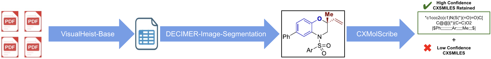

# C-MAGE

C-MAGE extracts chemical structures from the figures in a paper and translates them
into machine-readable CXSMILES.



| Stage | Component | Input → Output |
|---|---|---|
| 1 | VisualHeist | PDF pages → Figure/table Images |
| 2 | DECIMER Image Segmentation | Figures/tables → Individual Structure Images |
| 3 | CXMolScribe | Individual Structure Images → CXSMILES |

## Install

Needs ~7 GB of disk and Linux, Windows, or macOS 12+ on Apple Silicon. Intel
Macs cannot run it — PyTorch has published no macOS x86_64 wheels since 2.2.2.
A GPU is optional.

Users will also need conda. If you don't have it, install
[Miniforge](https://conda-forge.org/download/) — pick the file matching your
system and run it.

After conda is installed, clone C-MAGE's repository
```bash
git clone https://github.com/AlexTaylor54/C-MAGE.git
cd C-MAGE
./install.sh
```

That builds all three environments and installs everything.

## Run

1. Upload PDFs in `MERMaid/pdfdir/`.
2. Run:
```bash
./run_pipeline.sh
```

The first run downloads ~2.4 GB of models. `./run_pipeline.sh --help` lists alternative run
options — a different input folder, running only some stages, forcing CPU. 
To Run on Windows use `run_pipeline.py`.

## Results

Each run gets its own timestamped folder:

```
results/run_20260814-134947/03_CXMS_Results/
├── Completed_HighConfidence_CMAGE.xlsx    Structures with High Confidence
├── Completed_LowConfidence_CMAGE.xlsx     Structures with Low Confidence
├── highconfidence_images/
└── lowconfidence_images/
```

The split is on CXMolScribe's confidence at a threshold of 0.8431. Each row in the
spreadsheet shows the DECIMER-Image-Segmentation input next to the predicted CXSMILES and a
rendering of that CXSMILES, so an incorrect prediction is visible at a glance. The raw 
confidence value is also present in this row.

## Post Pipeline Processing

Once a dataset's Excel sheet has been annotated it can be organized into segmentation classifications by `cxmolscribe-wd/organize_category.py`.  This can be done for any Excel sheet by running the following command.

```bash
python cxmolscribe-wd/organize_category.py -- input NAME_OF_EXCEL.xlsx
```

Within this script, there are marked locations which will need to be modified based on which classification the user desires to sort.

To generate statistics on an annotated and graded C-MAGE output, run: 

```bash
python cxmolscribe-wd/analyze_database.py -- input NAME_OF_EXCEL.xlsx
```


---

`MERMaid/` and `cxmolscribe-wd/DECIMER-Image-Segmentation/` are vendored copies
of [MERMaid](https://github.com/aspuru-guzik-group/MERMaid) and
[DECIMER](https://github.com/Kohulan/DECIMER-Image-Segmentation).
